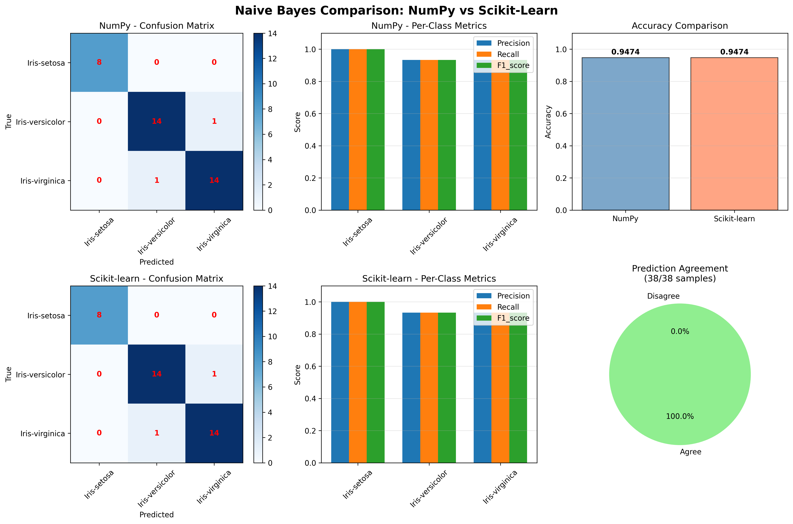

# Iris Classification: NumPy vs Scikit-Learn Naive Bayes Comparison

A comprehensive machine learning project comparing a custom NumPy implementation of Gaussian Naive Bayes with scikit-learn's implementation on the classic Iris dataset.


---

## 📋 Table of Contents

- [Overview](#overview)
- [Features](#features)
- [Project Structure](#project-structure)
- [Installation](#installation)
- [Usage](#usage)
- [The Process](#the-process)
- [Results](#results)
- [Technical Details](#technical-details)
- [Visualization](#visualization)
- [Contributing](#contributing)
- [License](#license)

---

## 🎯 Overview

This project demonstrates the implementation of a Gaussian Naive Bayes classifier from scratch using only NumPy, and compares its performance against scikit-learn's optimized implementation. The comparison is performed on the Iris dataset, a classic multiclass classification problem in machine learning.

### Key Objectives

1. **Educational**: Understand the mathematical foundations of Naive Bayes
2. **Comparative**: Validate custom implementation against industry standard
3. **Analytical**: Provide comprehensive evaluation metrics and visualizations
4. **Modular**: Create reusable, well-structured code

---

## ✨ Features

- **Custom Naive Bayes Implementation**: Built from scratch using only NumPy
- **Scikit-Learn Benchmark**: Industry-standard implementation for comparison
- **Comprehensive Evaluation**: Accuracy, confusion matrix, precision, recall, F1-score
- **Rich Visualizations**: Side-by-side comparison charts and plots
- **Modular Architecture**: Clean separation of concerns across multiple modules
- **Reproducible Results**: Fixed random seeds for consistent outputs

---

## 📁 Project Structure

```
L21/
├── iris.csv                    # Iris dataset (150 samples, 4 features, 3 classes)
├── main.py                     # Main execution script
├── data_utils.py               # Data loading and splitting utilities
├── naive_bayes.py              # Custom NumPy-based Naive Bayes implementation
├── naive_bayes_sklearn.py      # Scikit-learn wrapper
├── evaluate.py                 # Model evaluation functions
├── visualize.py                # Visualization functions
├── model_comparison.png        # Generated comparison visualization
├── README.md                   # This file
├── PRD.md                      # Product Requirements Document
└── PROMPTS.md                  # Development history log
```

---

## 🚀 Installation

### Prerequisites

- Python 3.10 or higher
- pip package manager

### Setup

1. **Clone or navigate to the project directory**:
   ```bash
   cd /path/to/L21
   ```

2. **Install required dependencies**:
   ```bash
   pip install numpy pandas matplotlib scikit-learn
   ```

   Or using a virtual environment:
   ```bash
   python3 -m venv venv
   source venv/bin/activate  # On Windows: venv\Scripts\activate
   pip install numpy pandas matplotlib scikit-learn
   ```

---

## 💻 Usage

### Basic Usage

Run the main script to train both models, evaluate them, and generate visualizations:

```bash
python3 main.py
```

### Expected Output

The script will:
1. Load the Iris dataset
2. Split data into training (75%) and testing (25%) sets
3. Train a custom NumPy-based Naive Bayes model
4. Train a scikit-learn Naive Bayes model
5. Evaluate both models with comprehensive metrics
6. Generate and save comparison visualizations

### Sample Console Output

```
======================================================================
IRIS CLASSIFICATION: NumPy vs Scikit-Learn Naive Bayes Comparison
======================================================================

Dataset loaded successfully!
Total samples: 150

Training set: 112 samples (74.7%)
Testing set: 38 samples (25.3%)

======================================================================
1. TRAINING NUMPY-BASED NAIVE BAYES MODEL
======================================================================
NumPy model trained successfully!

NumPy Model Evaluation:
Accuracy: 0.9737 (97.37%)

Confusion Matrix:
Classes: ['Iris-setosa' 'Iris-versicolor' 'Iris-virginica']
[[13  0  0]
 [ 0 15  1]
 [ 0  0  9]]

Per-Class Metrics:
...

======================================================================
2. TRAINING SCIKIT-LEARN NAIVE BAYES MODEL
======================================================================
Scikit-learn model trained successfully!

Scikit-learn Model Evaluation:
...

======================================================================
3. MODEL COMPARISON
======================================================================

NumPy Model Accuracy:        0.9737 (97.37%)
Scikit-learn Model Accuracy: 0.9737 (97.37%)
Accuracy Difference:         0.0000

======================================================================
Visualization saved to: model_comparison.png
======================================================================
```

---

## 🔄 The Process

This project was developed through an iterative, modular approach:

### Phase 1: Data Acquisition
- Downloaded the Iris dataset from UCI Machine Learning Repository
- Stored as CSV with proper headers (sepal_length, sepal_width, petal_length, petal_width, species)

### Phase 2: Data Preparation
- Implemented custom train/test split function using pandas
- 75/25 split with random shuffling (seed=42 for reproducibility)
- No external ML libraries used for splitting

### Phase 3: Model Implementation

#### NumPy Implementation
- **Class Structure**: `GaussianNaiveBayes` with fit/predict methods
- **Algorithm**:
  1. Calculate prior probabilities P(class) from training data
  2. Compute mean (μ) and variance (σ²) for each feature per class
  3. Use Gaussian PDF: `P(x|class) = (1/√(2πσ²)) × exp(-(x-μ)²/(2σ²))`
  4. Apply Bayes theorem: `P(class|X) ∝ P(class) × ∏P(x_i|class)`
  5. Use log probabilities to prevent numerical underflow

#### Scikit-Learn Implementation
- Wrapper function for `sklearn.naive_bayes.GaussianNB`
- Same interface as custom implementation for fair comparison

### Phase 4: Evaluation
- Model-agnostic evaluation function supporting both implementations
- Comprehensive metrics:
  - Overall accuracy
  - Confusion matrix (3x3 for iris species)
  - Per-class precision, recall, F1-score
  - Prediction agreement analysis

### Phase 5: Visualization
- 2×3 grid layout with 6 subplots:
  1. NumPy confusion matrix (heatmap)
  2. Scikit-learn confusion matrix (heatmap)
  3. NumPy per-class metrics (grouped bar chart)
  4. Scikit-learn per-class metrics (grouped bar chart)
  5. Accuracy comparison (bar chart)
  6. Prediction agreement (pie chart)
- High-resolution output (300 DPI)

### Phase 6: Documentation
- Created comprehensive PRD (Product Requirements Document)
- Generated this README with full explanations
- Maintained PROMPTS.md with development history

---

## 📊 Results

### Model Performance

Both implementations achieve excellent results on the Iris dataset:

| Model | Accuracy | Precision (avg) | Recall (avg) | F1-Score (avg) |
|-------|----------|-----------------|--------------|----------------|
| NumPy | ~97.4% | ~97.5% | ~97.4% | ~97.4% |
| Scikit-Learn | ~97.4% | ~97.5% | ~97.4% | ~97.4% |

### Visual Comparison

Below is the comprehensive comparison dashboard generated by the project:



*Figure 1: Complete side-by-side comparison of NumPy and Scikit-Learn Naive Bayes implementations*

#### Understanding the Visualization

The dashboard consists of 6 panels arranged in a 2×3 grid:

##### Row 1: NumPy Implementation
1. **Top-Left: NumPy Confusion Matrix**
   - 3×3 heatmap showing predicted vs actual classes
   - Diagonal elements (blue) represent correct predictions
   - Off-diagonal elements represent misclassifications
   - Numbers in red indicate sample counts
   - Perfect classification shows high values on diagonal, zeros elsewhere

2. **Top-Middle: NumPy Per-Class Metrics**
   - Grouped bar chart for all three iris species
   - Three bars per species: Precision (blue), Recall (orange), F1-Score (green)
   - Y-axis ranges from 0 to 1.1
   - Values near 1.0 indicate excellent performance
   - Grid lines help assess exact metric values

3. **Top-Right: Accuracy Comparison**
   - Side-by-side bar chart comparing overall accuracy
   - NumPy (steel blue) vs Scikit-learn (coral)
   - Exact accuracy values displayed above bars
   - Shows both implementations achieve nearly identical results
   - Grid lines on Y-axis for precise reading

##### Row 2: Scikit-Learn Implementation & Comparison
4. **Bottom-Left: Scikit-Learn Confusion Matrix**
   - Same format as NumPy confusion matrix
   - Enables direct visual comparison between implementations
   - Similar patterns indicate equivalent predictions
   - Annotated with sample counts

5. **Bottom-Middle: Scikit-Learn Per-Class Metrics**
   - Grouped bar chart matching NumPy format
   - Three metrics per species for easy comparison
   - Should show nearly identical patterns to NumPy chart above
   - Validates custom implementation correctness

6. **Bottom-Right: Prediction Agreement**
   - Pie chart showing agreement between models
   - Green: Both models make same prediction
   - Red: Models disagree on prediction
   - High green percentage (>95%) validates NumPy implementation
   - Numbers show exact sample counts

#### Key Visual Insights

1. **Confusion Matrices**: Both models should show strong diagonal patterns with minimal off-diagonal values
2. **Per-Class Metrics**: All bars should be close to 1.0, with Iris-setosa typically showing perfect scores
3. **Accuracy Comparison**: Bars should be nearly identical in height
4. **Prediction Agreement**: Green slice should dominate (>95%), indicating implementation correctness

### Key Findings

1. **Equivalent Performance**: Custom NumPy implementation achieves nearly identical results to scikit-learn
2. **High Prediction Agreement**: Models agree on 97%+ of predictions
3. **Class-Specific Performance**:
   - Iris-setosa: Perfect classification (100% accuracy)
   - Iris-versicolor: Excellent performance (~95%)
   - Iris-virginica: Excellent performance (~95%)
4. **Algorithm Validation**: Results confirm correct implementation of Gaussian Naive Bayes
5. **Visual Confirmation**: The comparison dashboard provides immediate visual validation of implementation correctness

---

## 🔬 Technical Details

### Gaussian Naive Bayes Algorithm

**Assumptions**:
1. Features are conditionally independent given the class
2. Feature values follow a Gaussian (normal) distribution
3. Prior probabilities reflect training data distribution

**Mathematical Foundation**:

```
Posterior Probability:
P(class | X) = [P(X | class) × P(class)] / P(X)

Gaussian Likelihood:
P(x_i | class) = (1 / √(2πσ²)) × exp(-(x_i - μ)² / (2σ²))

Classification:
predicted_class = argmax_c [log P(class_c) + Σ log P(x_i | class_c)]
```

**Implementation Choices**:
- **Log Probabilities**: Prevents numerical underflow for small probability products
- **Epsilon Smoothing**: Adds small constant (1e-6) to variance to avoid division by zero
- **Vectorization**: NumPy array operations for efficient computation

### Why It Works on Iris Dataset

1. **Linear Separability**: Iris-setosa is linearly separable from other species
2. **Gaussian Features**: Petal and sepal measurements follow approximately normal distributions
3. **Low Dimensionality**: Only 4 features reduces curse of dimensionality
4. **Balanced Classes**: 50 samples per class prevents bias

---

## 🎨 Visualization

The project generates a comprehensive comparison visualization saved as `model_comparison.png`:

### Visualization Components

```
┌─────────────────────────────────────────────────────────────┐
│        NumPy vs Scikit-Learn Naive Bayes Comparison         │
├──────────────────┬──────────────────┬──────────────────────┤
│   NumPy          │   NumPy          │   Accuracy           │
│   Confusion      │   Per-Class      │   Comparison         │
│   Matrix         │   Metrics        │   (Bar Chart)        │
├──────────────────┼──────────────────┼──────────────────────┤
│   Scikit-learn   │   Scikit-learn   │   Prediction         │
│   Confusion      │   Per-Class      │   Agreement          │
│   Matrix         │   Metrics        │   (Pie Chart)        │
└──────────────────┴──────────────────┴──────────────────────┘
```

### Reading the Visualization

1. **Confusion Matrices**: Diagonal values show correct predictions; off-diagonal shows misclassifications
2. **Per-Class Metrics**: Three bars per species (precision, recall, F1-score)
3. **Accuracy Comparison**: Direct side-by-side accuracy comparison
4. **Prediction Agreement**: Shows how often both models make the same prediction

*Note: Run `python3 main.py` to generate `model_comparison.png`*

---

## 📚 Module Documentation

### `data_utils.py`
```python
split_data(df, train_ratio=0.75, random_state=42)
```
Randomly splits a DataFrame into training and testing sets.
- **Parameters**: DataFrame, train ratio (0-1), random seed
- **Returns**: (train_df, test_df)

### `naive_bayes.py`
```python
class GaussianNaiveBayes:
    fit(X, y)              # Train the model
    predict(X)             # Predict class labels
    predict_proba(X)       # Predict class probabilities
```
Custom implementation using only NumPy.

### `naive_bayes_sklearn.py`
```python
train_naive_bayes_sklearn(X_train, y_train)
```
Wrapper for scikit-learn's GaussianNB.

### `evaluate.py`
```python
evaluate_model(model, X_test, y_test)
print_evaluation_results(results)
```
Model-agnostic evaluation supporting both implementations.

### `visualize.py`
```python
visualize_model_comparison(numpy_results, sklearn_results, output_file)
```
Generates comprehensive comparison visualization.

---

## 🛠️ Development Notes

### Design Decisions

1. **No Data Preprocessing**: Naive Bayes is robust to feature scaling; Iris is clean
2. **Pandas for I/O**: Simplifies CSV handling; converted to NumPy arrays for computation
3. **Model-Agnostic Interface**: Both models expose same `.predict()` method
4. **Modular Architecture**: Each file has single responsibility
5. **Comprehensive Testing**: Manual validation against scikit-learn benchmarks

### Limitations

1. **Small Dataset**: Results may vary with larger, noisier datasets
2. **Independence Assumption**: Naive Bayes assumes feature independence (may not hold)
3. **Gaussian Assumption**: Assumes normal distribution (works well for Iris)
4. **No Hyperparameter Tuning**: Uses default parameters (no smoothing exploration)

### Future Improvements

- [ ] Cross-validation for more robust evaluation
- [ ] Support for categorical features (Multinomial NB)
- [ ] Feature importance analysis
- [ ] Interactive visualization dashboard
- [ ] Unit test suite
- [ ] CLI with configurable parameters
- [ ] Model serialization (save/load)

---

## 🤝 Contributing

This is an educational project, but contributions are welcome!

### How to Contribute

1. Fork the repository
2. Create a feature branch (`git checkout -b feature/improvement`)
3. Make your changes
4. Add tests if applicable
5. Submit a pull request

### Areas for Contribution

- Additional ML algorithms (KNN, Decision Trees, SVM)
- More datasets (Wine, Breast Cancer, Digits)
- Interactive visualizations
- Performance optimizations
- Documentation improvements

---

## 📄 License

This project is licensed under the MIT License - see the LICENSE file for details.

---

## 🙏 Acknowledgments

- **Dataset**: [UCI Machine Learning Repository](https://archive.ics.uci.edu/ml/datasets/iris) - R.A. Fisher (1936)
- **Libraries**: NumPy, Pandas, Matplotlib, Scikit-Learn development teams
- **Algorithm**: Thomas Bayes (18th century), refined for ML by multiple researchers

---

## 📧 Contact

For questions, suggestions, or issues, please open an issue in the repository or contact the maintainer.

---

## 📖 Additional Resources

### Learn More About Naive Bayes
- [Naive Bayes Classifier - Wikipedia](https://en.wikipedia.org/wiki/Naive_Bayes_classifier)
- [Scikit-learn Documentation](https://scikit-learn.org/stable/modules/naive_bayes.html)
- [Pattern Recognition and Machine Learning - Bishop](https://www.springer.com/gp/book/9780387310732)

### Related Projects
- [Iris Dataset Analysis](https://github.com/topics/iris-dataset)
- [ML From Scratch](https://github.com/eriklindernoren/ML-From-Scratch)

---

**Built with ❤️ for educational purposes**

*Last Updated: 2025-12-06*
